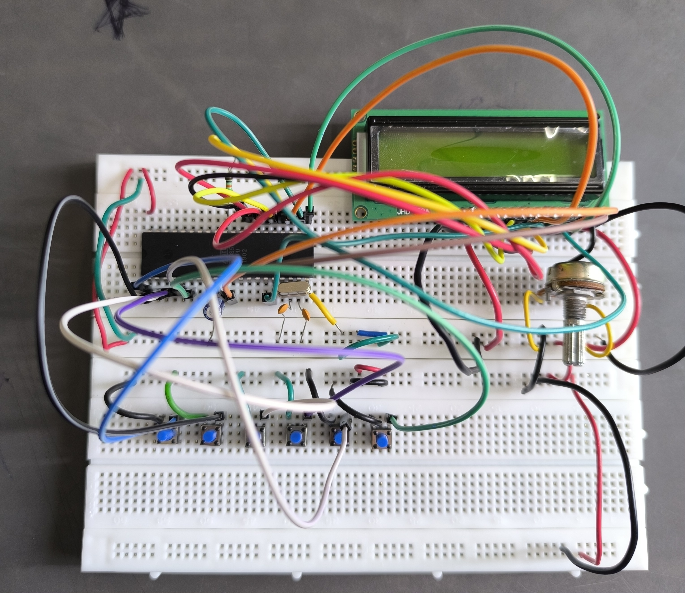
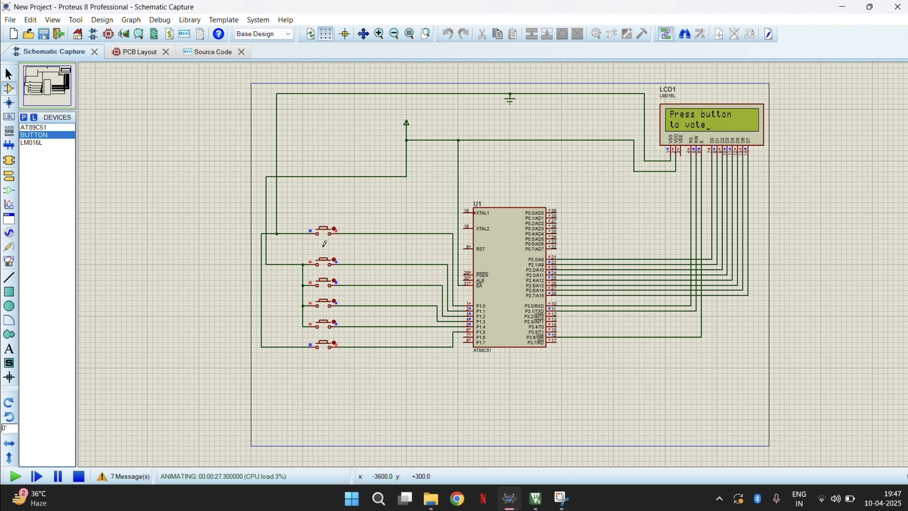

# Electronic Voting Machine (EVM) using 8051 Microcontroller

A standalone, hardware-based Electronic Voting Machine (EVM) prototype built using the **8051 microcontroller architecture (AT89C51)** and programmed in **Embedded C**. This project demonstrates embedded system foundations, including discrete input polling, programmatic data processing, state machine routing, and parallel data transmission to alphanumeric visual interfaces. 

The system provides a secure environment for localized voting by integrating candidate input switches, a master initialization switch for polling officers, data validation loops to prevent illegal double-voting, and automated multi-candidate tallying logic.

---

## 📸 Project Media & Circuit Layout

### Physical Implementation
Below is the physical hardware setup and circuit assembly for this project:

### Proteus Circuit Simulation
Below is the schematic capture and software simulation diagram designed in Proteus:

### Step-by-Step System Assembly
A close-up look at the wiring connection stages:

---

## 🛠️ Hardware Architecture & Components
The system topology integrates the following core hardware elements managed by the primary 8-bit microcontroller:

* **Microcontroller**: AT89C51 (Classic 8051 core operating via generic register configuration headers)
* **Display Interface**: 16x2 Character LCD (mapped to Port 2 for 8-bit parallel data, with RS, RW, and E control lines assigned to Port 3)
* **Input Peripherals**: Active-High tactile push-buttons mapped to Port 1 (supporting Initialization, Termination, and 4 separate Candidate nodes)
* **Status Signaling**: Auditory confirmation loops embedded within the data latch routines

---

## ⚙️ Core Technical Features
* **Tamper Prevention & Debouncing**: Programmed software blocks ignore additional inputs immediately after a button press, locking the state machine until explicitly released by the polling officer.
* **Dynamic LCD Tallying**: Implements custom integer-to-ASCII conversion subroutines to map raw multi-digit voting integers onto standard character-matrix display positions.
* **Tie-Breaking Tally Algorithm**: Features automated loop checking that dynamically monitors maximum vote arrays to detect data clashes and output a clean "Tie" warning if multiple candidates share the peak position.
* **Optimized Delay Routines**: Built around deterministic dual-nested software loops to establish reliable timing constraints without relying on external hardware clocks.

---

## 📜 Repository File Guide
* **[evm.c](./evm.c)**: The complete Embedded C implementation source code containing initialization matrices, visual drivers, input validation loops, and logical calculation engines.

---

## 📜 Open Source Attribution
This project implementation adapts open-source architectural paradigms shared across the embedded engineering community on GitHub. Modifications were introduced to modernize the 16x2 LCD interface layout and optimize state monitoring paths for responsive physical deployment.
